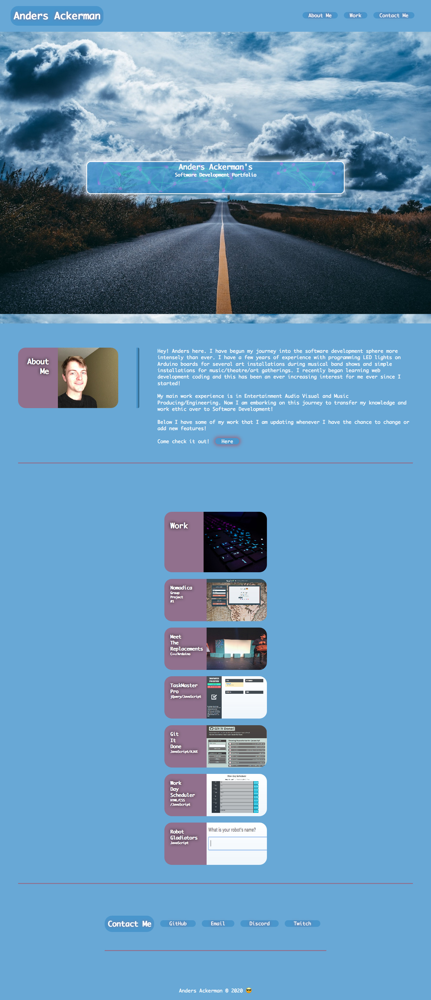

# Anders Ackerman Software Development Portfolio

## Application Deployment Link
https://dj-viking.github.io/anders-ackerman.github.io/

## Summary
This is my personal portfolio page for all things web development and software development.
I'm currently learning the web development sphere of HTML, CSS, Javascript, and the various other languages and frameworks. I have some experience in C, and C++ with Arduino microcontroller programming.

## Optimization
This Page has been optimized for various screens ranging from the regular laptop screen all the way down to the iPhone.

## Screenshot

Screenshot saves kinda weird as an entire firefox page screenshot lol 🤷🏼‍♂️

